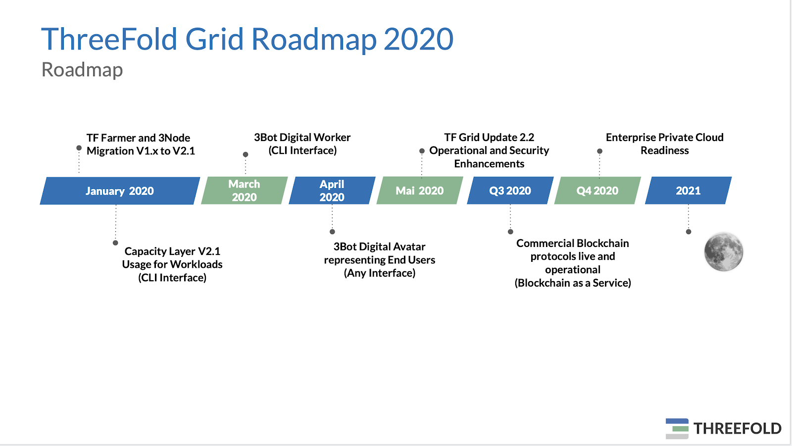
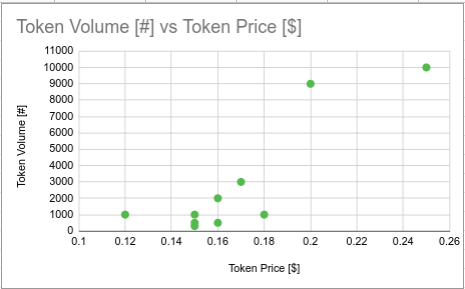
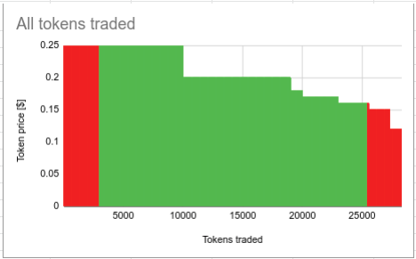
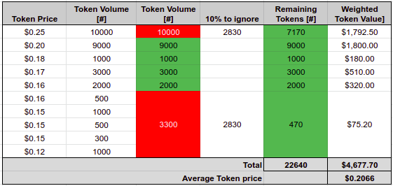

# TF Grid Update DEC 30th 2019

## Roadmap Update:

TF Farmer and 3Node migration from TF Grid version 1.x to version 2.0  will start the 3rd week of January 2020. After the migration of a minimum of 80% of all farmers and 3Nodes the TF capacity layer can be used to deploy and run workloads using CLI. For March 2020 we plan to release the 1st version of the so called 3Bot Digital Worker which allows to run workloads in an autonomous way on the TF capacity layer. The digital avatar, the 3Bot end user version will be launched in April and can be used with any interface. Examples of interface that can be added to the 3Bot are a chat interface equivalent to the chat bots in telegram or  a voice interface like with siri, alexa or google.

## Concept: TFT Price for TF Farming

The TFT Price at the start of farming defines the total (possible) amount of TFT’s minted by the farmer equipment for the 60 month period. Historically the TFT pricing has been:
*   TFT price from 1st of April 2018 until the 31st of December 2018:		USD 0.10
*   TFT price from 1st of January 2019 until the 31st of January 2019:	USD 0.12
*   TFT price from 1st of February 2020:					USD 0.15

After the ThreeFold IEO on Liquid (which ends approximately March 10th 2020) the TFT price for the start of farming will be calculated as the weighted average of the last 3 months periods of TFT traded on public exchanges. The 10% highest and 10% lowest weighted token trades will not be used for calculating the TFT price for start of farming. This should eliminate the extremities in trading patterns. The TFT Price for the start of farming will be rounded to the 4th digit after the comma. This TFT price will be calculated after the end of the first 3 periods of 2020 and is valid for the following 3 periods. The first TFT price for farming will be calculated on March 31st 2020.

### Simple trading period example to explain the concept

Consider the following trades for an example period of three month:.

| Trade | Token Volume | Token Price [USD] |
| ---- | ---- | ---- |
| 1	| 10,000 | 0.25 |
| 2 |	1,000 | 0.12 |
| 3 |	500 | 0.15 |
| 4 |	2,000 | 0.16 |
| 5 |	300 |	0.15 |
| 6 |	3,000 |  0.17 |
| 7 |	9,000 |	 0.20 |
| 8 |	1,000 | 0.15 |
| 9 |	500 | 0.16 |
| 10 | 1,000 | 0.18 |

This would read as follows in a graph showing the token pricing vs. the trade volume.

In this period a total of 28,300 tokens were traded. Trade 1 traded at the highest price (0.25 USD) and trade 2 (0.12 USD) at the lowest price. In order to cut 10% of the tokens traded at the highest price and 10% of the lowest price we have to organise all tokens traded in a sequence from high to low.

Once we have organised all single tokens trades in a sequence we can quite easily cut 10% of highest traded token and lowest traded tokens.  See the red markers in the graph.  Please note that in this example the 10% of highest price traded tokens fits into a single trade while the 10% of lowest price traded tokens spans 5 trades.  Remember that these are just example trades, it might be the reverse in real life where high price trades represent lower volumes and low price trades higher volumes, but the principles stay the same.

See table below where the token trades have been ordered from the highest price to the lowest and where we take out both 10 percentiles:

So for the coming 3 months period the token price for new farming equipment will be set at the weighted average token price of 0.2066 USD.

## Pilot Projects:

We run a bunch of pilot projects in Q1 2020 with partners to prove the TF technology.

### HPE DACH

Pilot project to showcase TF capacity farming using existing over-capacity from HPE customers and the usage of capacity through application services which can be sold through HPE GreenLake. Application services in the project scope are object storage, big data analytics plus edge and IoT use cases.

### Country Cloud Partner

Proof of Concept (PoC) demonstrating B2B and B2C services based on TF capacity and technology. This PoC will define when and how this country cloud will be rolled out. More details about this PoC can be shared end of January.

### Solidaridad

Solidaridad is planning a platform to collect and store farming (real farming) information for smallholders (operating a plot less than one acre).  The aim is to build up a large farming data lake where the individual farmers retain ownership of their data and the total dataset can be used for big data analysis purposes creating valuable reports for NGOs, Multinationals and governments. The financial return generated by refining the total dataset and creating respors is funneled back to the data owners (smallholder farmers).

### Blockchain Protocol Partner

Dragonchain is a blockchain protocol creator that offers private and public (blockchain as a service) services based on their technology ([www.dragonchain.com](http://www.dragonchain.com)) and the digital giants providing cloud capacity (Amazon, Microsoft and Google).  They are looking to break free from these monopolists and have a decentralised,  for anyone by many, platform to provide blockchain services.  On the 7th of January Dragonchain is organising a 24 hours streaming event in which they want to prove that their technology is able to sustain very high transaction workloads for a sustained period of time. Unfortunately this will not include the ThreeFold grid as of yet, but straight after this even a pilot project will commence.
